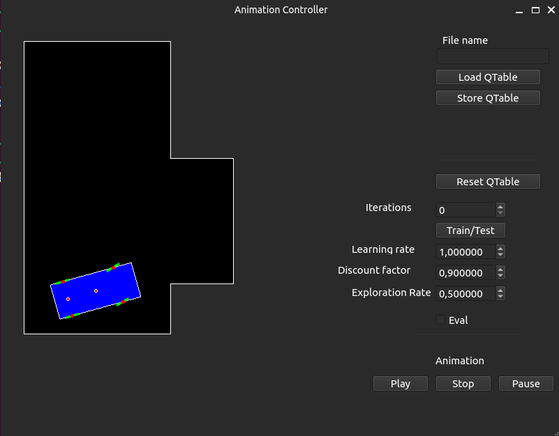

# Car Parking Project



An C++ project with Qt graphical interface to train and simulate autonomous car parking using **Q-learning**.  
Developed entirely in C++ from scratch, including physics, learning, and UI. 
This project is part of the [*Neural Networks and Deep Learning*](http://retis.sssup.it/~giorgio/courses/neural/nn.html) course by **Prof. G. C. Buttazzo**  

## Overview

This project simulates a car learning to park autonomously using a **Q-learning** reinforcement learning algorithm, complete with:

- **Bicycle kinematic model** with overhearing simulation
- **Collision detection** and boundary handling
- **Map generation system** with customizable layouts
- **Full Q-Learning** with sparse reward system 
- **Qt-based GUI** for visualization and interaction

##  Build Instructions

### Prerequisites

- **Qt (version 5 or 6)** installed and in your system path

### Steps

1. **Clone the repository**:

    ```sh
    git clone https://github.com/your-user/carparking.git
    cd carparking
    ```

2. **Generate makefile using `qmake`:**

    ```sh
    qmake carparking.pro
    ```

3. **Build the project:**

    ```sh
    make
    ```

4. **Run the simulation:**

    ```sh
    ./bin/carparking
    ```

## Configuration

All main simulation and training parameters are stored in:

```bash
configuration/default.conf
